# AI-DLC - Tổng Quan Kiến Trúc Workflow

## Mô tả

AI-DLC (AI-Driven Development Life Cycle) là một quy trình phát triển phần mềm có cấu trúc, chia thành 3 phase chính, mỗi phase chứa nhiều stage. Workflow tự động điều chỉnh (adaptive) dựa trên độ phức tạp của yêu cầu.

## Sơ đồ tổng quan 3 Phase

```mermaid
flowchart TD
    Start(["🚀 User Request"])

    subgraph INCEPTION["🔵 INCEPTION PHASE - Planning & Architecture"]
        direction TB
        WD["Workspace Detection<br/><b>ALWAYS</b>"]
        RE["Reverse Engineering<br/><b>CONDITIONAL</b><br/>(Brownfield only)"]
        RA["Requirements Analysis<br/><b>ALWAYS</b><br/>(Adaptive depth)"]
        US["User Stories<br/><b>CONDITIONAL</b>"]
        WP["Workflow Planning<br/><b>ALWAYS</b>"]
        AD["Application Design<br/><b>CONDITIONAL</b>"]
        UG["Units Generation<br/><b>CONDITIONAL</b>"]
    end

    subgraph CONSTRUCTION["🟢 CONSTRUCTION PHASE - Design, Implementation & Test"]
        direction TB
        FD["Functional Design<br/><b>CONDITIONAL</b><br/>(per-unit)"]
        NFR_REQ["NFR Requirements<br/><b>CONDITIONAL</b><br/>(per-unit)"]
        NFR_DES["NFR Design<br/><b>CONDITIONAL</b><br/>(per-unit)"]
        ID["Infrastructure Design<br/><b>CONDITIONAL</b><br/>(per-unit)"]
        CG["Code Generation<br/><b>ALWAYS</b><br/>(per-unit)"]
        BT["Build and Test<br/><b>ALWAYS</b>"]
    end

    subgraph OPERATIONS["🟡 OPERATIONS PHASE - Deployment & Monitoring"]
        OPS["Operations<br/><b>PLACEHOLDER</b>"]
    end

    Start --> WD
    WD -.->|brownfield| RE
    WD -->|greenfield| RA
    RE --> RA
    RA -.-> US
    RA --> WP
    US --> WP
    WP -.-> AD
    WP -.-> UG
    AD -.-> UG

    UG --> FD
    WP --> CG
    FD -.-> NFR_REQ
    NFR_REQ -.-> NFR_DES
    NFR_DES -.-> ID
    ID --> CG
    FD --> CG
    CG -.->|"Next Unit"| FD
    CG --> BT
    BT -.-> OPS
    BT --> End(["✅ Complete"])

    style Start fill:#CE93D8,stroke:#6A1B9A,stroke-width:3px,color:#000
    style End fill:#CE93D8,stroke:#6A1B9A,stroke-width:3px,color:#000
    style WD fill:#4CAF50,stroke:#1B5E20,stroke-width:3px,color:#fff
    style RA fill:#4CAF50,stroke:#1B5E20,stroke-width:3px,color:#fff
    style WP fill:#4CAF50,stroke:#1B5E20,stroke-width:3px,color:#fff
    style CG fill:#4CAF50,stroke:#1B5E20,stroke-width:3px,color:#fff
    style BT fill:#4CAF50,stroke:#1B5E20,stroke-width:3px,color:#fff
    style RE fill:#FFA726,stroke:#E65100,stroke-width:3px,stroke-dasharray: 5 5,color:#000
    style US fill:#FFA726,stroke:#E65100,stroke-width:3px,stroke-dasharray: 5 5,color:#000
    style AD fill:#FFA726,stroke:#E65100,stroke-width:3px,stroke-dasharray: 5 5,color:#000
    style UG fill:#FFA726,stroke:#E65100,stroke-width:3px,stroke-dasharray: 5 5,color:#000
    style FD fill:#FFA726,stroke:#E65100,stroke-width:3px,stroke-dasharray: 5 5,color:#000
    style NFR_REQ fill:#FFA726,stroke:#E65100,stroke-width:3px,stroke-dasharray: 5 5,color:#000
    style NFR_DES fill:#FFA726,stroke:#E65100,stroke-width:3px,stroke-dasharray: 5 5,color:#000
    style ID fill:#FFA726,stroke:#E65100,stroke-width:3px,stroke-dasharray: 5 5,color:#000
    style OPS fill:#BDBDBD,stroke:#424242,stroke-width:2px,stroke-dasharray: 5 5,color:#000
    style INCEPTION fill:#BBDEFB,stroke:#1565C0,stroke-width:3px,color:#000
    style CONSTRUCTION fill:#C8E6C9,stroke:#2E7D32,stroke-width:3px,color:#000
    style OPERATIONS fill:#FFF59D,stroke:#F57F17,stroke-width:3px,color:#000
```

## Chú thích

| Màu | Ý nghĩa |
|-----|---------|
| 🟢 Xanh lá (solid) | Stage luôn thực thi (ALWAYS) |
| 🟠 Cam (dashed) | Stage có điều kiện (CONDITIONAL) |
| ⚪ Xám (dashed) | Placeholder - chưa triển khai |
| 🟣 Tím | Điểm bắt đầu / kết thúc |

## Nguyên tắc Adaptive

- **Stage Selection**: Binary — EXECUTE hoặc SKIP
- **Detail Level**: Adaptive — từ minimal đến comprehensive tùy độ phức tạp
- Workflow Planning quyết định stage nào chạy dựa trên phân tích yêu cầu
