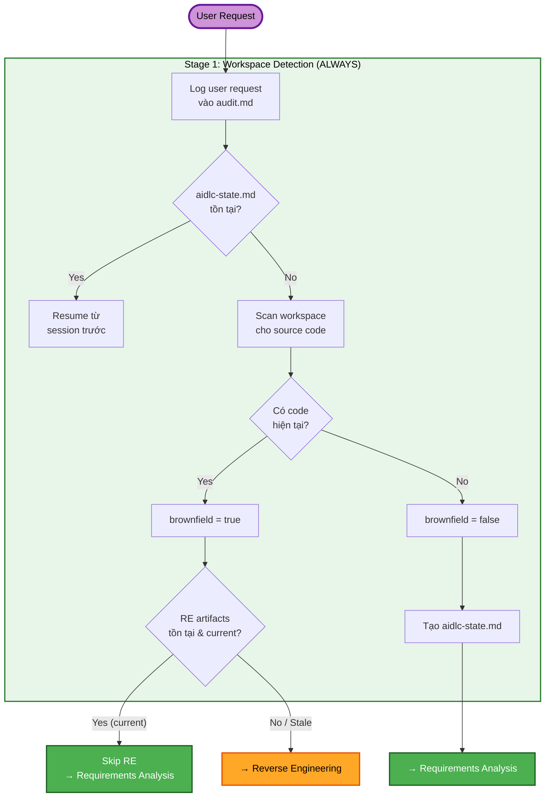
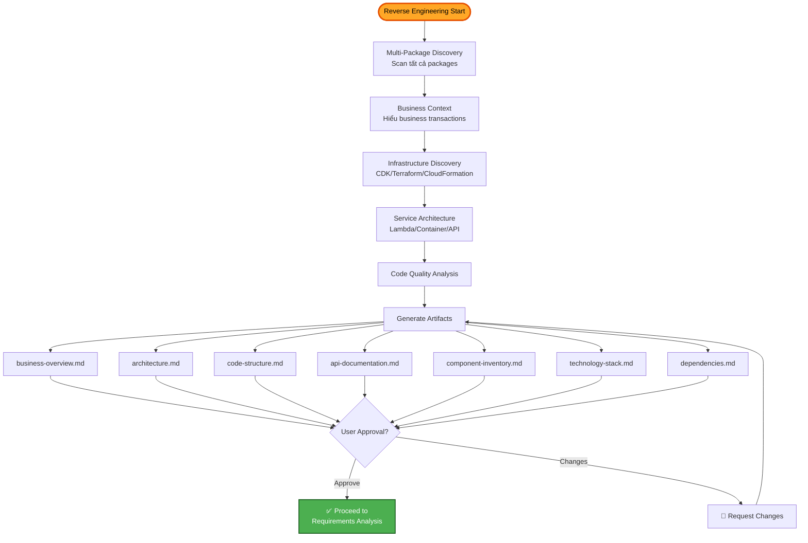
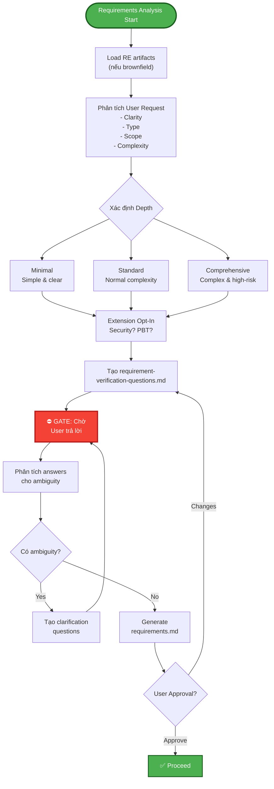
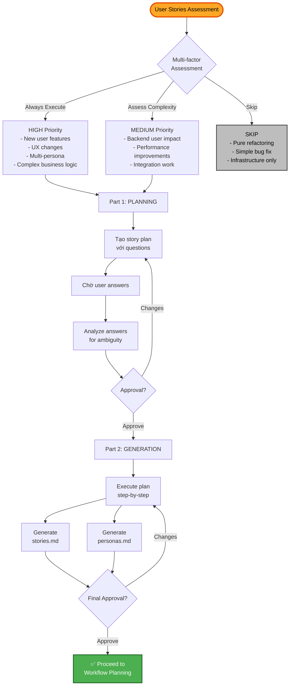
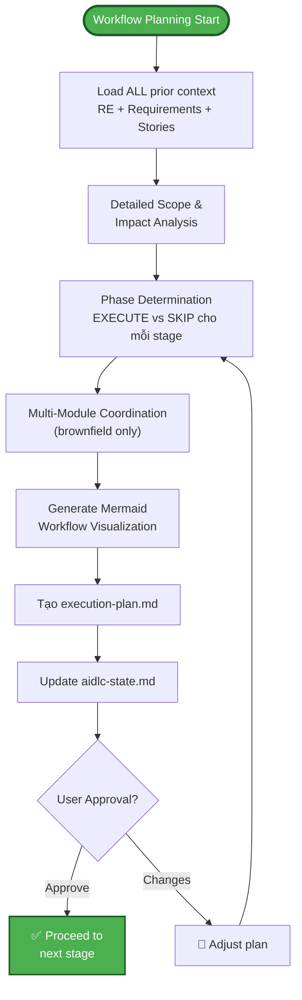
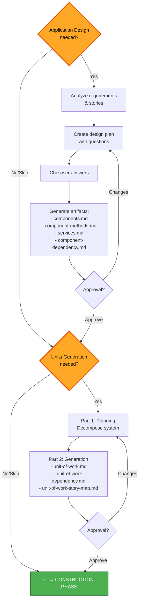

# AI-DLC - INCEPTION PHASE (Chi tiết)

## Mục đích

Phase INCEPTION tập trung vào việc xác định **CÁI GÌ** cần xây dựng và **TẠI SAO**. Bao gồm phân tích yêu cầu, thiết kế kiến trúc ứng dụng, và lập kế hoạch thực thi.

## Luồng xử lý chi tiết

## Reverse Engineering (Brownfield Only)

## Requirements Analysis (ALWAYS - Adaptive Depth)

## User Stories (CONDITIONAL)

## Workflow Planning (ALWAYS)

## Application Design & Units Generation (CONDITIONAL)

