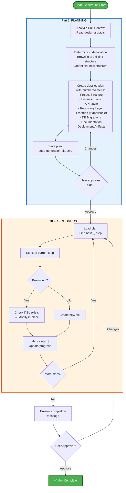
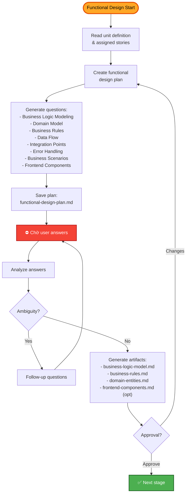
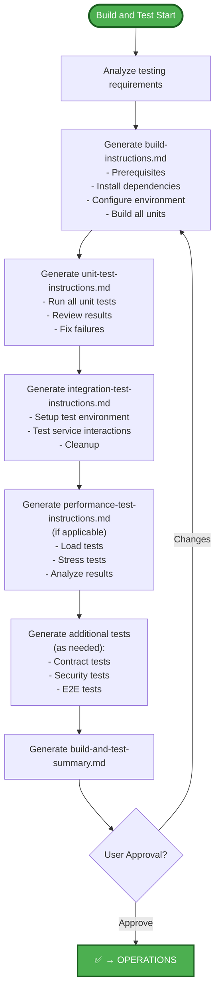

# AI-DLC - CONSTRUCTION PHASE (Chi tiết)

## Mục đích

Phase CONSTRUCTION tập trung vào **CÁCH** xây dựng. Bao gồm thiết kế chi tiết, sinh code, và kiểm thử. Mỗi unit of work được xử lý hoàn chỉnh (design → code) trước khi chuyển sang unit tiếp theo.

## Luồng Per-Unit Loop

```mermaid
flowchart TD
    CONST_START(["CONSTRUCTION PHASE Start"])

    UNIT_LOOP["Lấy Unit tiếp theo<br/>từ unit-of-work.md"]

    subgraph PER_UNIT["🔄 Per-Unit Loop"]
        direction TB
        FD{"Functional Design<br/>needed?"}
        FD_EXEC["Functional Design<br/>- business-logic-model.md<br/>- business-rules.md<br/>- domain-entities.md"]
        FD_APPROVE{"Approval?"}

        NFR_REQ{"NFR Requirements<br/>needed?"}
        NFR_REQ_EXEC["NFR Requirements<br/>- nfr-requirements.md<br/>- tech-stack-decisions.md"]
        NFR_REQ_APPROVE{"Approval?"}

        NFR_DES{"NFR Design<br/>needed?"}
        NFR_DES_EXEC["NFR Design<br/>- nfr-design-patterns.md<br/>- logical-components.md"]
        NFR_DES_APPROVE{"Approval?"}

        INFRA{"Infrastructure Design<br/>needed?"}
        INFRA_EXEC["Infrastructure Design<br/>- infrastructure-design.md<br/>- deployment-architecture.md"]
        INFRA_APPROVE{"Approval?"}

        CG["Code Generation<br/>(ALWAYS)"]
        CG_PLAN["Part 1: Planning<br/>code-generation-plan.md"]
        CG_GEN["Part 2: Generation<br/>Execute plan step-by-step"]
        CG_APPROVE{"Approval?"}
    end

    MORE_UNITS{"Còn unit<br/>khác?"}
    BT["Build and Test<br/>(ALWAYS)"]
    BT_EXEC["Generate test instructions:<br/>- build-instructions.md<br/>- unit-test-instructions.md<br/>- integration-test-instructions.md<br/>- performance-test-instructions.md"]
    BT_APPROVE{"Approval?"}
    DONE(["✅ CONSTRUCTION Complete"])

    CONST_START --> UNIT_LOOP
    UNIT_LOOP --> FD

    FD -->|Yes| FD_EXEC
    FD -->|Skip| NFR_REQ
    FD_EXEC --> FD_APPROVE
    FD_APPROVE -->|Approve| NFR_REQ
    FD_APPROVE -->|Changes| FD_EXEC

    NFR_REQ -->|Yes| NFR_REQ_EXEC
    NFR_REQ -->|Skip| NFR_DES
    NFR_REQ_EXEC --> NFR_REQ_APPROVE
    NFR_REQ_APPROVE -->|Approve| NFR_DES
    NFR_REQ_APPROVE -->|Changes| NFR_REQ_EXEC

    NFR_DES -->|Yes| NFR_DES_EXEC
    NFR_DES -->|Skip| INFRA
    NFR_DES_EXEC --> NFR_DES_APPROVE
    NFR_DES_APPROVE -->|Approve| INFRA
    NFR_DES_APPROVE -->|Changes| NFR_DES_EXEC

    INFRA -->|Yes| INFRA_EXEC
    INFRA -->|Skip| CG
    INFRA_EXEC --> INFRA_APPROVE
    INFRA_APPROVE -->|Approve| CG
    INFRA_APPROVE -->|Changes| INFRA_EXEC

    CG --> CG_PLAN
    CG_PLAN --> CG_GEN
    CG_GEN --> CG_APPROVE
    CG_APPROVE -->|Approve| MORE_UNITS
    CG_APPROVE -->|Changes| CG_GEN

    MORE_UNITS -->|Yes| UNIT_LOOP
    MORE_UNITS -->|No| BT
    BT --> BT_EXEC
    BT_EXEC --> BT_APPROVE
    BT_APPROVE -->|Approve| DONE
    BT_APPROVE -->|Changes| BT_EXEC

    style CONST_START fill:#C8E6C9,stroke:#2E7D32,stroke-width:3px,color:#000
    style DONE fill:#CE93D8,stroke:#6A1B9A,stroke-width:3px,color:#000
    style CG fill:#4CAF50,stroke:#1B5E20,stroke-width:3px,color:#fff
    style BT fill:#4CAF50,stroke:#1B5E20,stroke-width:3px,color:#fff
    style PER_UNIT fill:#E8F5E9,stroke:#2E7D32,stroke-width:2px,color:#000
```

## Code Generation - Chi tiết 2 phần

## Functional Design - Chi tiết

## Build and Test - Chi tiết

