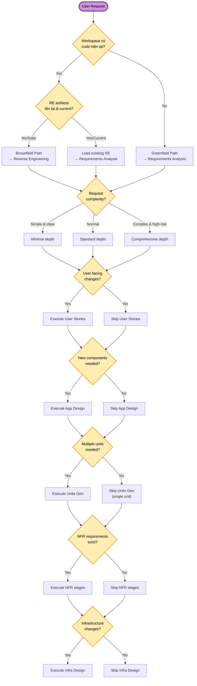
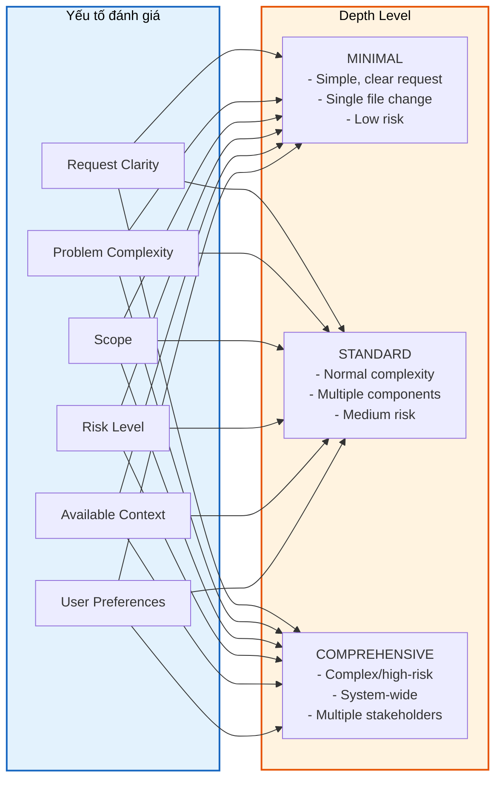
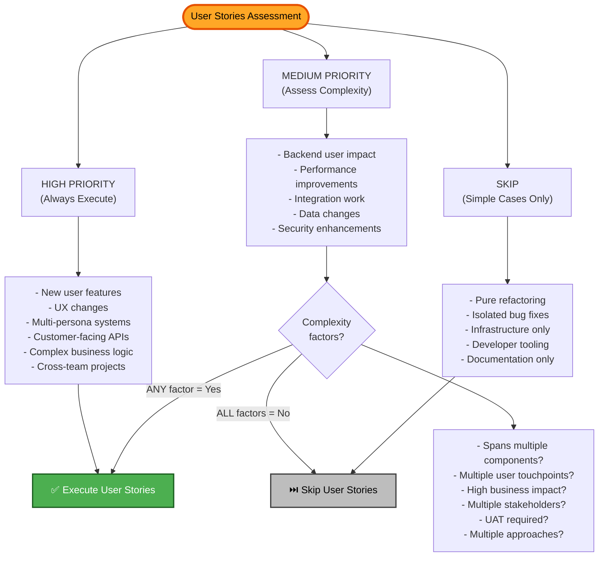
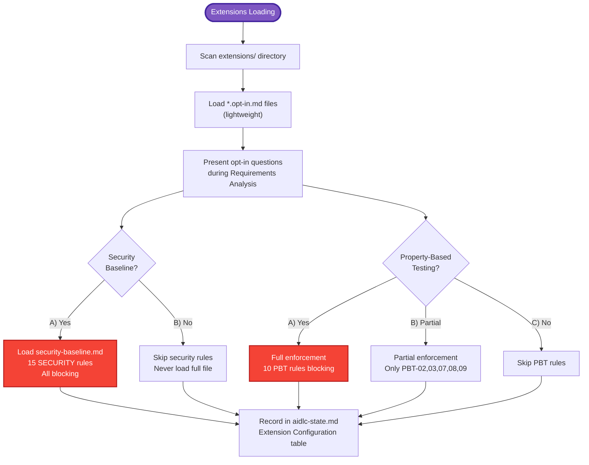
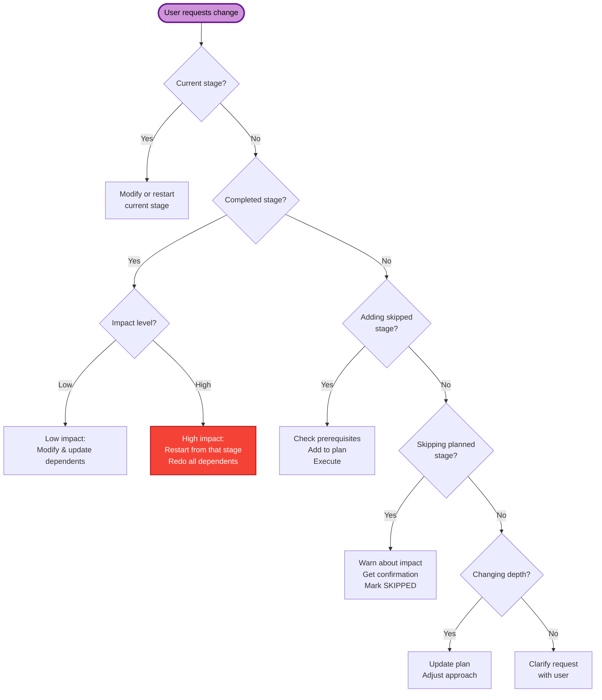

# AI-DLC - Logic Quyết Định & Branching

## Mục đích

Tài liệu này mô tả các điểm quyết định (decision points) trong workflow AI-DLC — nơi hệ thống phân nhánh dựa trên điều kiện cụ thể.

## Decision Tree Tổng Quan

## Adaptive Depth Decision

## User Stories Assessment Logic

## Extension Opt-In Decision Flow

## Mid-Workflow Change Decision Tree

