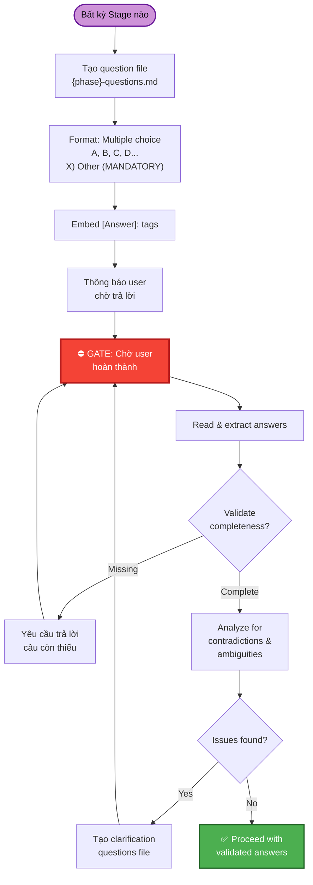
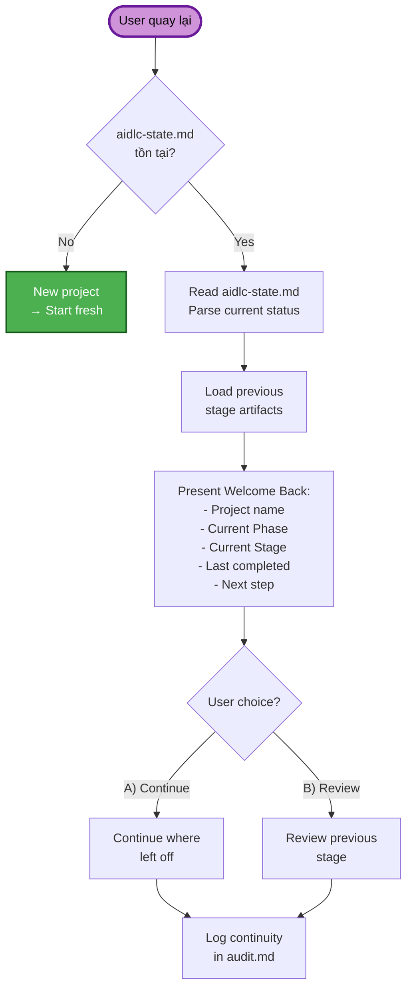
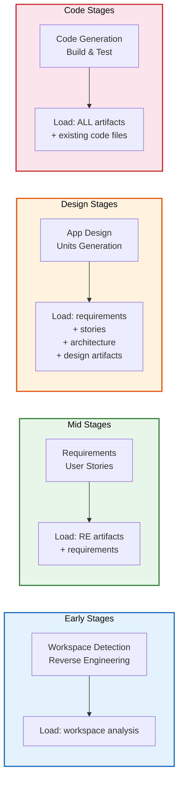
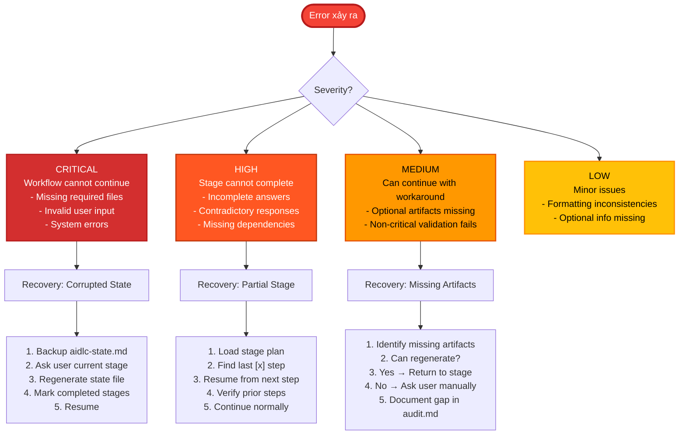
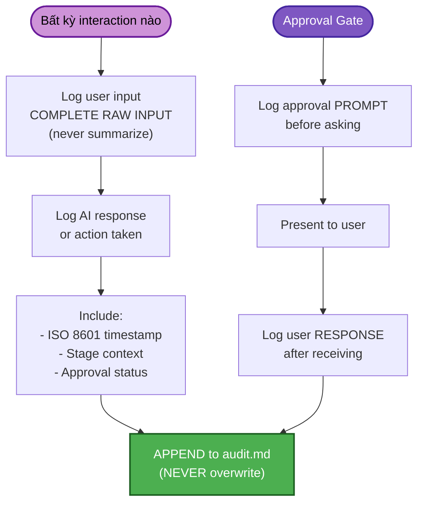
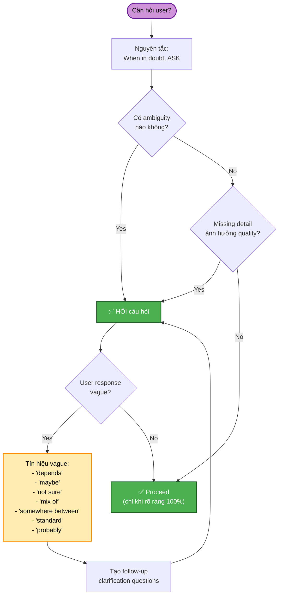
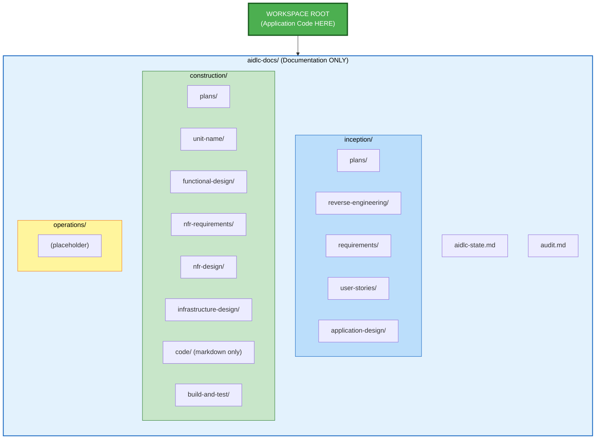
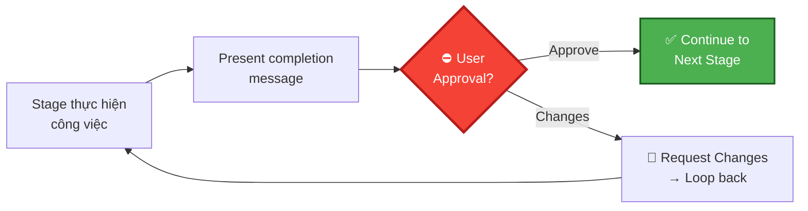

# AI-DLC - Cross-Cutting Concerns & Cơ chế hỗ trợ

## Mục đích

Tài liệu này mô tả các cơ chế xuyên suốt (cross-cutting) áp dụng cho toàn bộ workflow AI-DLC: question format, session continuity, error handling, content validation, và audit logging.

## Question & Answer Flow

## Session Continuity Flow

## Smart Context Loading by Stage

## Error Handling & Recovery

## Audit Logging Flow

## Overconfidence Prevention Pattern

## Directory Structure

## Checkpoint Pattern (Approval Gates)

Mỗi stage trong CONSTRUCTION phase sử dụng **standardized 2-option completion message**:
1. 🔧 **Request Changes** — quay lại sửa
2. ✅ **Continue to Next Stage** — approve và tiến tới stage tiếp theo
