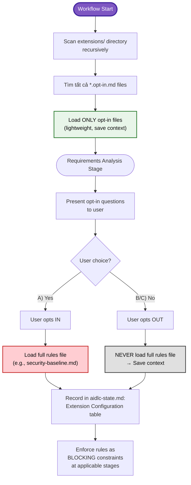
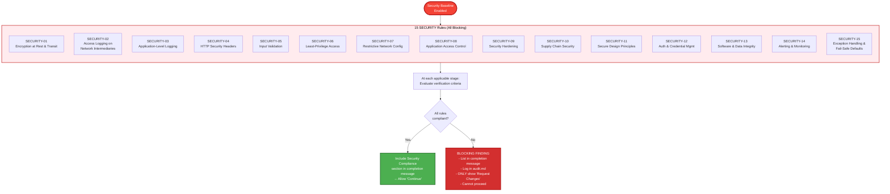
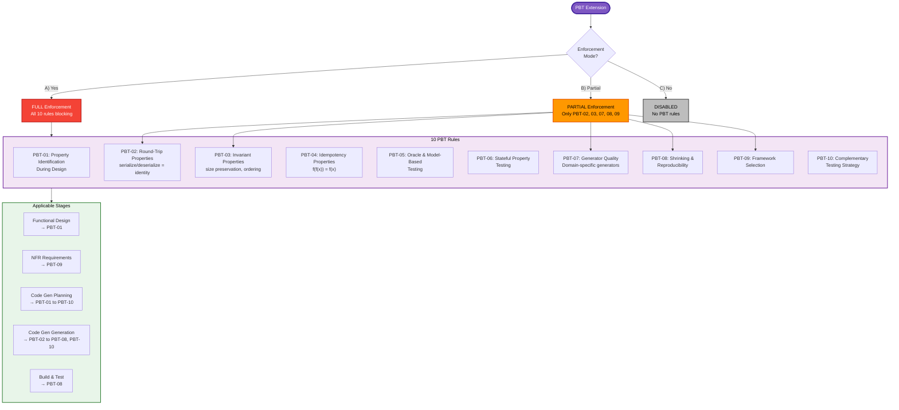
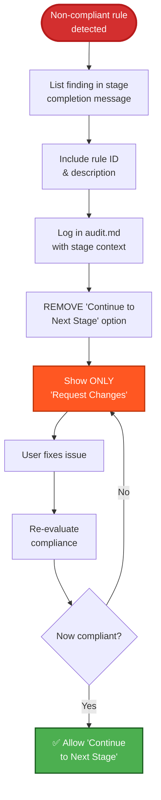
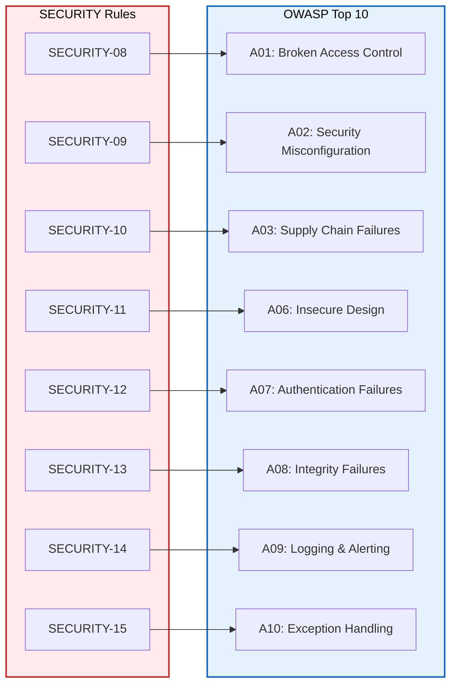

# AI-DLC - Extensions System

## Mục đích

Extensions là hệ thống mở rộng cho phép thêm các quy tắc bắt buộc (blocking constraints) vào workflow AI-DLC. Hiện tại có 2 extensions: Security Baseline và Property-Based Testing.

## Extension Loading Mechanism

## Security Baseline Extension

## Property-Based Testing Extension

## Blocking Finding Behavior

## OWASP Mapping (Security Extension)

